# Exercicios MYSQL - CURSO DESENVOLVEDOR BACKEND

- [x] 1- Liste o nome completo e o id_aluno de todos os estudantes cadastrados, ordenando pelo nome do aluno. 

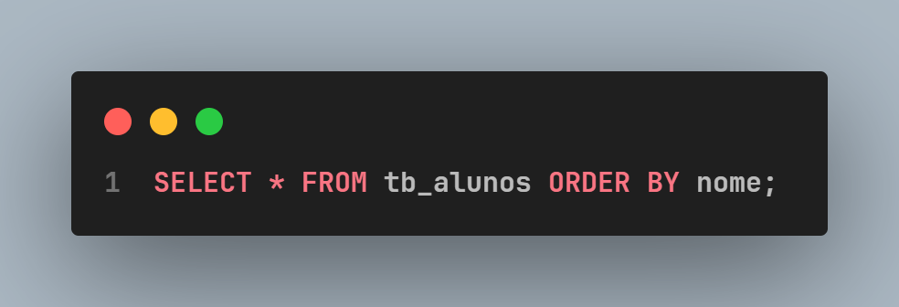
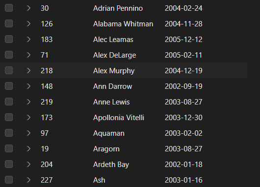

---

- [x] 2.	Quais são as siglas e os nome_curso de todos os cursos que possuem exatamente 1200 horas de carga_horaria?
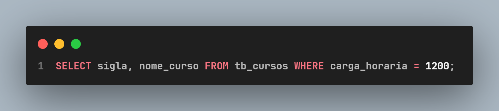
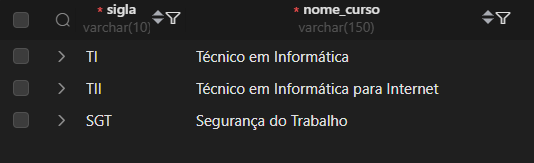

---

- [x] 3.	Exiba o nome e a especialidade de todos os docentes que são especializados em 'Programação'.

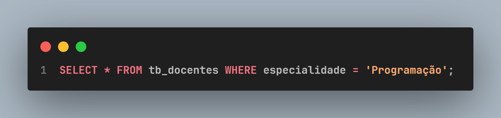
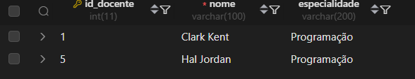

---

- [x] 4.	Liste o id_sala, numero_sala e capacidade de todas as salas que são do tipo 'TEORICA'.

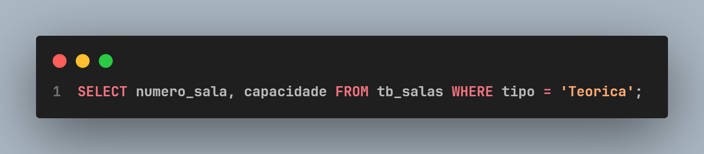
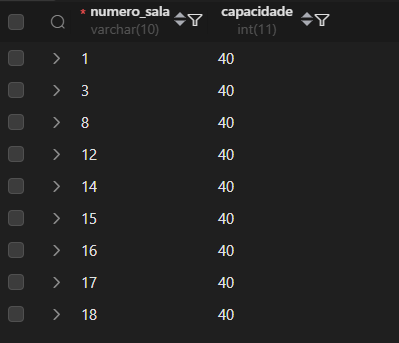

--- 

- [x] 5.	Quais são as sigla_turma que ocorrem no turno 'TARDE'?

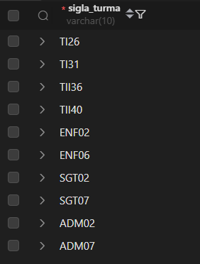

- [x] 6.	Encontre o id_aluno e o nome do aluno cujo ID é 149.

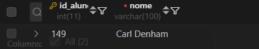

- [x] 7. Liste o nome_sala e o numero_sala de todas as salas que têm uma capacidade máxima de 30.

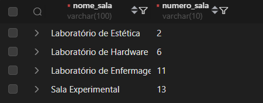

- [x] 8.	Quais cursos (apenas a sigla) têm 1000 horas de carga horária?

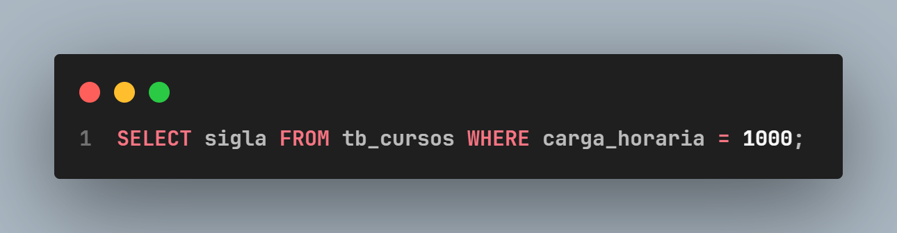
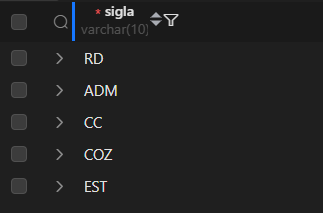

- [x] 9.	Liste o nome dos alunos cujo nome começa com a letra 'W'.

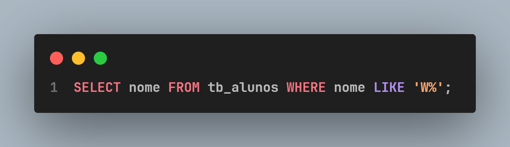
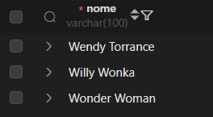

- [x] 10.	Exiba o nome e a especialidade do docente com id_docente igual a 7.

- [x] 11.	Liste todas as siglas de turmas que têm o turno 'NOITE' e cujo id_curso_fk é 2 (TII).

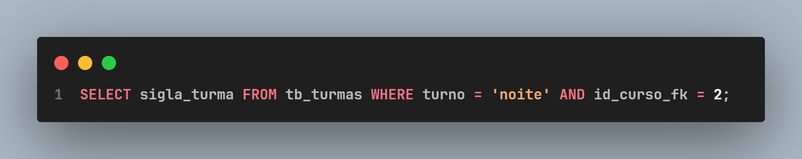
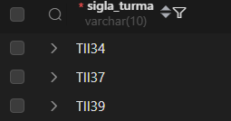

- [x] 12.	Liste o nome de todos os alunos que nasceram exatamente em doze de março de dois mil e cinco.

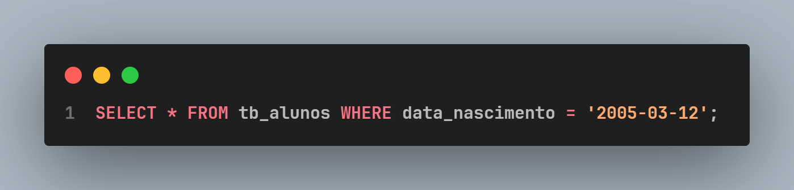
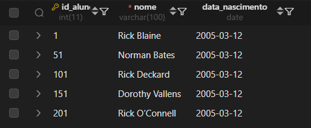

- [x] 13. Quais turmas (siglas) foram alocadas no Lab de Hardware?

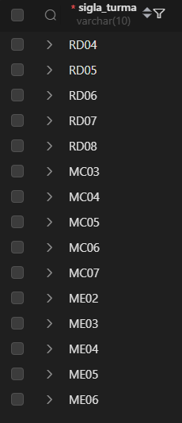

-[x] 14. Liste o id_curso e o nome_curso de todos os cursos, exceto aqueles com carga_horaria menor ou igual 800 horas.

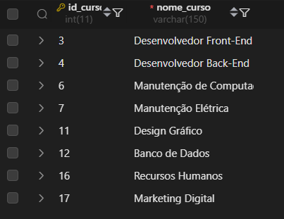
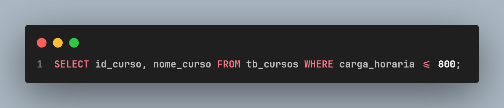

- [x] 15.	Liste os nomes de todos os docentes que não são especializados em 'Enfermagem'.

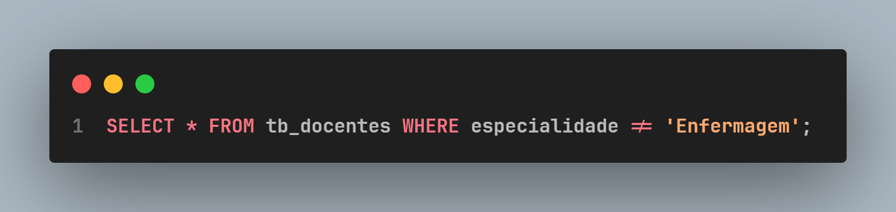
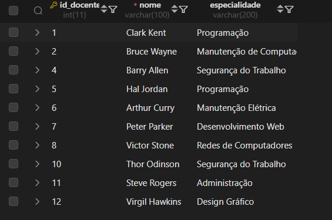

--- 

## Parte 2: Questões Moderadas (JOINs Simples)

- [x] 16.	Liste o nome e o id_aluno de todos os alunos que estão matriculados na turma com id_turma_fk igual a 17 (ENF01). (Use tb_alunos e tb_aluno_turma).

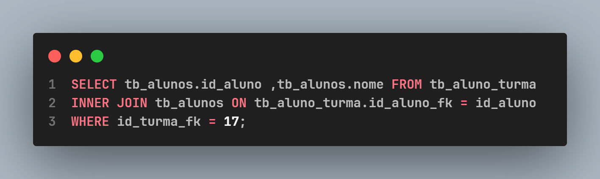
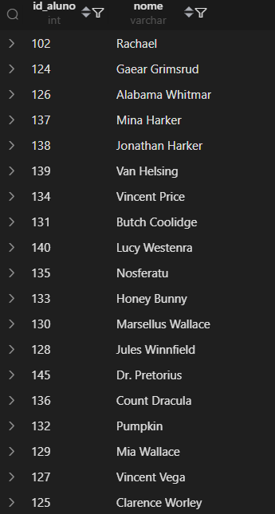

-[x] 17.	Qual é o nome do curso correspondente ao id_curso = 10?

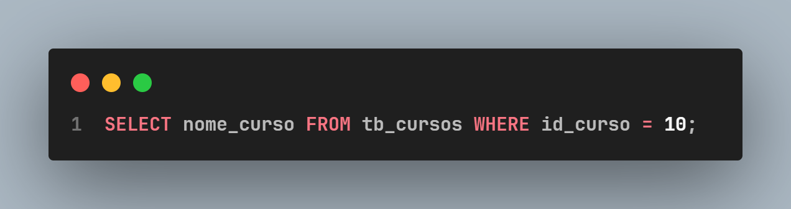
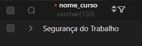

- [x] 18.	Liste o nome dos docentes que estão qualificados para o curso cujo id_curso_fk é 19.

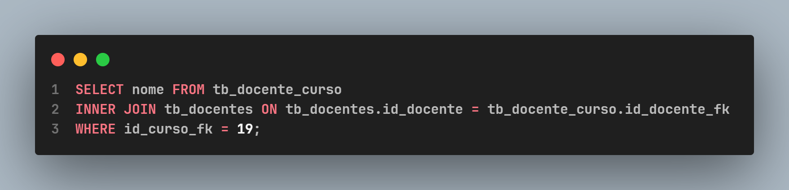
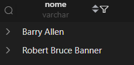

- [x] 19.	Encontre a sigla_turma e o turno de todas as turmas que estão alocadas na sala com id_sala_fk igual a 11 (Laboratório de Enfermagem).

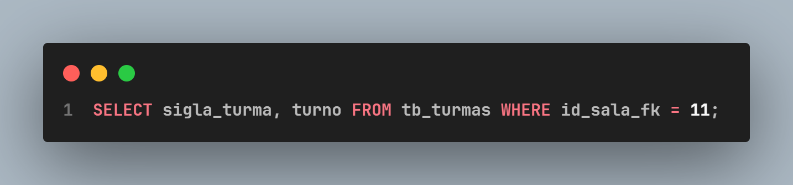

- [x] 20.	Liste a sigla do curso e o nome_curso para todas as turmas cujo id_turma esteja entre 56 e 60. (Use tb_turmas e tb_cursos).

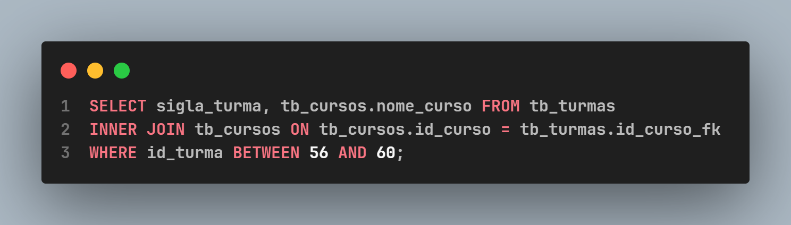
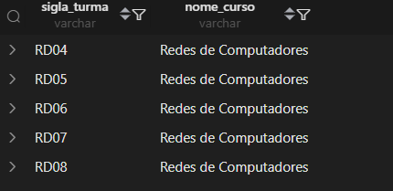

- [x] 21.	Liste a nome_sala de todas as salas que são utilizadas por turmas do turno 'MANHA'.

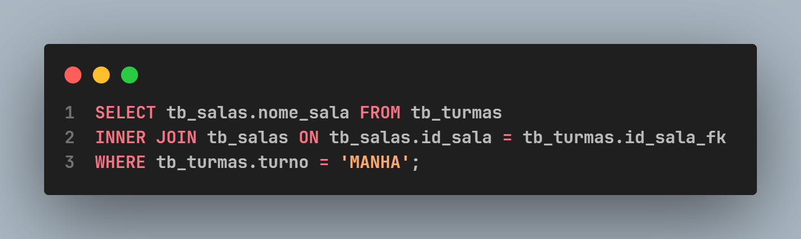
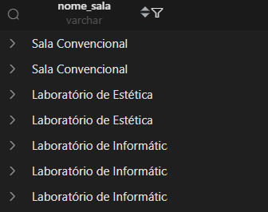

- [x] 22.	Liste o id_docente e o nome dos professores que estão qualificados para o curso de 'Redes de Computadores' (id_curso = 5).

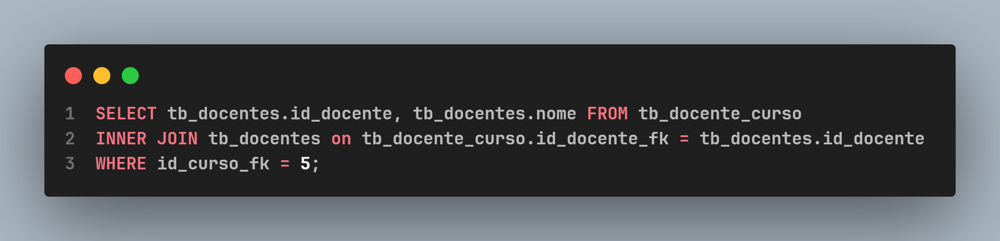
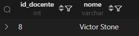

- [x] 23.	Liste o nome dos alunos que estão matriculados na turma de sigla 'SGT04'.

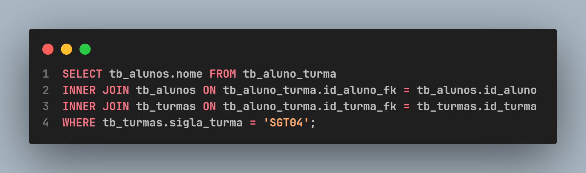
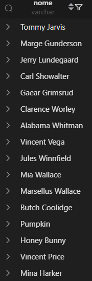

- [x] 24.	Encontre o nome_curso de todas as turmas que estão alocadas na sala 'Laboratório de Hardware'.

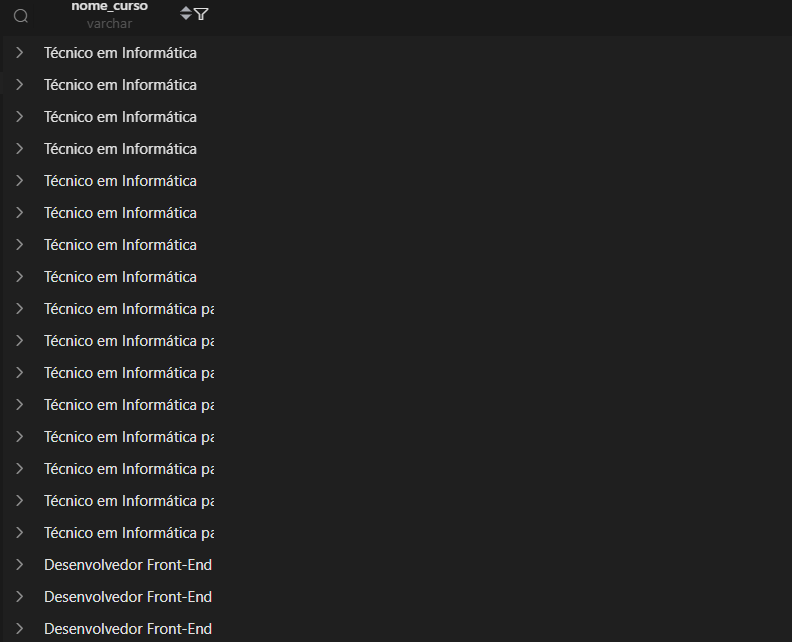

- [x] 25.	Liste o id_aluno_turma e o id_aluno_fk para todas as matrículas no ADM08.

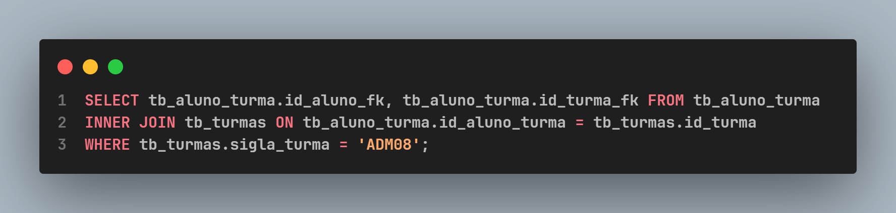
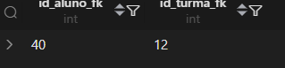

## Parte 3: Questões Complexas (Multi-JOINs e Filtros Específicos)

- [x] 26.	Liste o nome do aluno e a sigla_turma para todos os alunos que estão matriculados na turma TI25.

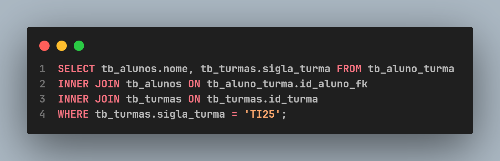
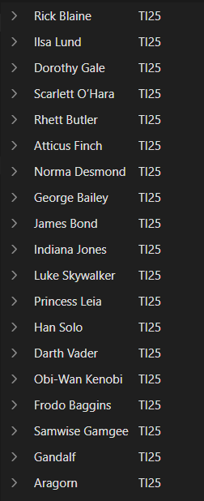

- [x] 27.	Encontre o nome do docente e o nome_curso para as associações onde o docente tem id_docente = 3.

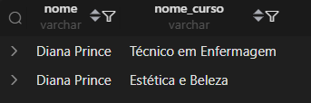
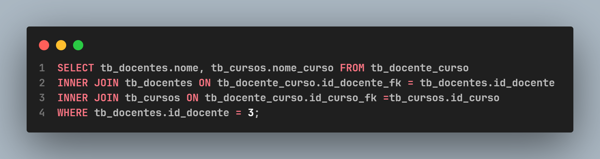

- [x] 28.	Liste a sigla_turma e o nome_sala para as turmas do curso 'Administração' que estão alocadas em salas com capacidade igual a 40..

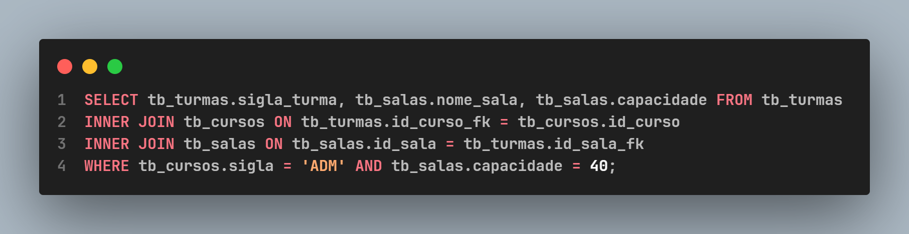
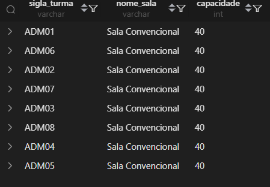

- [x] 29.	Liste o nome de todos os alunos que estão matriculados na turma TI26 OU na turma TI30.

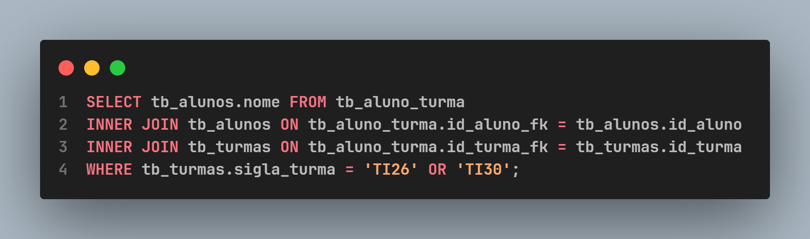
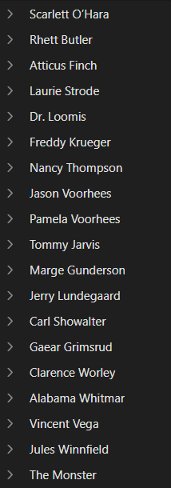

- [x] 30.	Liste os nomes de todas as salas que são do tipo 'LABORATORIO' E que possuem uma capacidade menor que 35.

- [x] 31.	Liste o nome_curso de todos os cursos para os quais a docente 'Diana Prince' está qualificado.

- [x] 32.	Qual é a sigla_turma e o nome_curso de todas as turmas que utilizam a sala 'Laboratório de Enfermagem'?

- [x] 33.	Liste o nome dos alunos que estão matriculados na turma 'TI29'.

